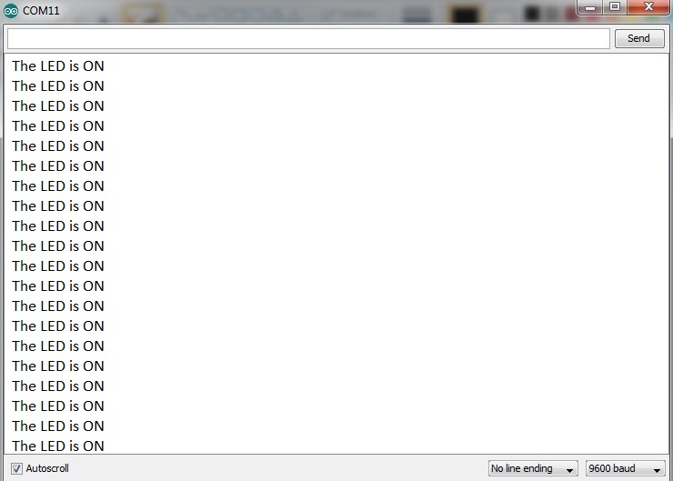

# Communication-over-Serial-Monitor

Communication over Serial Monitor by reading the data from Serial Monitor as 'ON/OFF' and turn the led on the basis it.

Required Materials:

  1)Arduino
  
  2)LED
  
  3)Arduino IDE
  
### The constructed circuit
When ON is typed:

When OFF is typed:

### Circuit 
The circuit diagram (Made using Fritzing)

### The Serial Monitor

When ON is typed:

When OFF is typed:

#### NOTE: If any other number is pressed, it shows '48 + that number', and the LED gets switched off.
